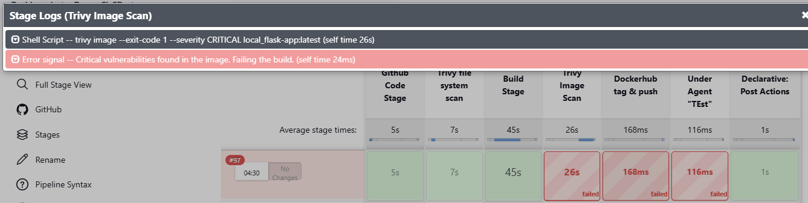
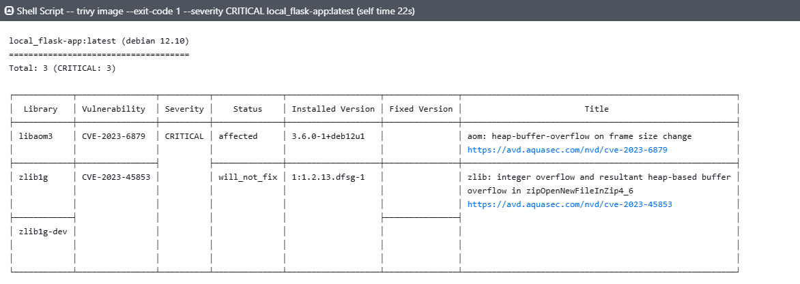

## Task 6: Integrate Vulnerability Scanning with Trivy


### Add a Vulnerability Scan Stage

``` Script
        
        stage('Trivy file system scan') {
            steps {
                sh "trivy fs . -o results.json"

            }
        }
                stage('Build Stage') {
            steps {
                sh "docker build -t local_flask-app:latest ."

            }
        }
        
                stage('Trivy Image Scan') {
            steps {
            script {
                def scanOutput = sh(returnStatus: true, script: 'trivy image --exit-code 1 --severity CRITICAL local_flask-app:latest')
                if (scanOutput != 0) {
                    error("Critical vulnerabilities found in the image. Failing the build.")
                }
            }
        }
        }
        
```

### 2) Configure Fail Criteria:

 * set the stage to fail the build if critical vulnerabilities are detected.




### 3) Summarize the scan output



### **Trivy Vulnerability Scan Summary**  

The Trivy scan detected vulnerabilities in the scanned Docker image. Below is a summary of the key findings:  

#### **Critical Vulnerability**  
1. **libaom3**  
   - **CVE:** [CVE-2023-6879](https://avd.aquasec.com/nvd/cve-2023-6879)  
   - **Severity:** **CRITICAL**  
   - **Issue:** Heap buffer overflow when changing frame size  
   - **Installed Version:** 3.6.0-1+deb12u1  
   - **Status:** **Affected**  
   - **Fix Available:** No  

#### **High/Medium Vulnerabilities**  
2. **zlib1g**  
   - **CVE:** [CVE-2023-45853](https://avd.aquasec.com/nvd/cve-2023-45853)  
   - **Severity:** Not explicitly stated  
   - **Issue:** Integer overflow leading to heap-based buffer overflow in `zipOpenNewFileInZip4_6`  
   - **Installed Version:** 1:1.2.13.dfsg-1  
   - **Status:** **Will Not Fix**  
   - **Fix Available:** No  

#### **Other Components**  
- **zlib1g-dev**  
  - No vulnerabilities explicitly listed in this scan.  

## Interview Questions:
### **Why is Integrating Vulnerability Scanning into a CI/CD Pipeline Important?**  
Integrating vulnerability scanning into a CI/CD pipeline is crucial for several reasons:  

1. **Early Detection & Prevention** – Identifying vulnerabilities early in the development cycle helps prevent security issues from reaching production.  
2. **Continuous Security Compliance** – Ensures that security checks are automated, reducing the risk of deploying insecure applications.  
3. **Reduced Attack Surface** – Scanning dependencies and container images minimizes security risks by catching known vulnerabilities.  
4. **Regulatory Compliance** – Helps meet industry security standards (e.g., OWASP, NIST, ISO 27001).  
5. **Cost Efficiency** – Fixing vulnerabilities in early development is significantly cheaper than in production.  
6. **Trust & Reliability** – Strengthens the security posture of applications, increasing trust in software releases.  

---

### **How Does Trivy Improve the Security of Docker Images?**  
Trivy is an open-source vulnerability scanner that enhances Docker image security by:  

1. **Comprehensive Scanning** – Detects vulnerabilities in OS packages (e.g., Alpine, Ubuntu) and application dependencies (e.g., npm, Maven).  
2. **Lightweight & Fast** – Performs quick scans with minimal overhead, making it efficient for CI/CD pipelines.  
3. **Security Misconfiguration Detection** – Identifies misconfigurations in Kubernetes manifests and Infrastructure-as-Code (IaC) files.  
4. **SBOM Generation** – Helps track software components and vulnerabilities by generating Software Bill of Materials (SBOM).  
5. **Supports Multiple Integrations** – Works seamlessly with Jenkins, GitHub Actions, GitLab CI/CD, and Kubernetes.  
6. **Regular CVE Database Updates** – Keeps up-to-date with the latest vulnerabilities via sources like NVD, GitHub Security Advisories, and Red Hat Security Data.  

By integrating Trivy into your Jenkins pipeline, you ensure that only secure, vulnerability-free Docker images are deployed.