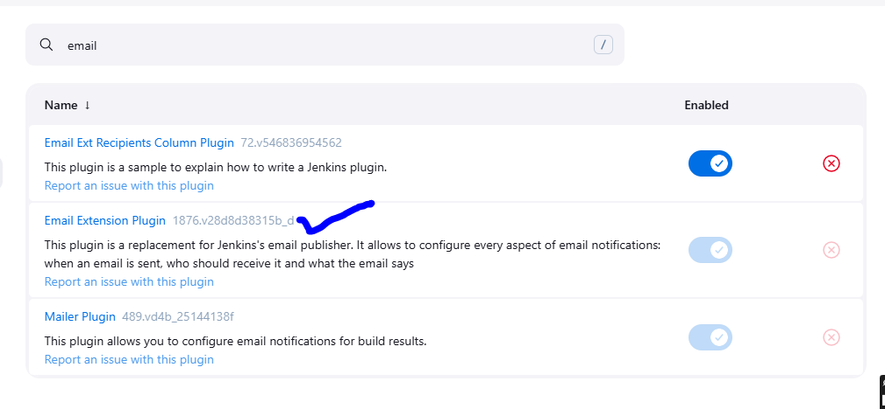
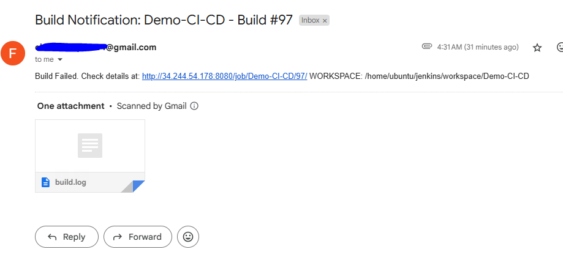
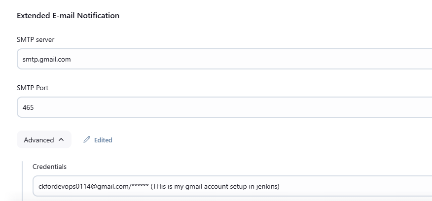

## Task 8: Integrate Email Notifications for Build Events

### Plugin:



### EMAIL test



### Jenkins Manage Settings



### SCRIPT

``` script

post {
    success {
        emailext body: "The build has completed successfully. Check details at: ${env.BUILD_URL}", attachLog: true,
            subject: "Build Notification: ${env.JOB_NAME} - Build #${env.BUILD_NUMBER}",
            to: "ckfordevops0114@gmail.com"

    }
    failure {
        emailext body: "Build Failed. Check details at: ${env.BUILD_URL} WORKSPACE: ${WORKSPACE}", attachLog: true,
        from: "noreplychandru@gmail.com",
        subject: "Build Notification: ${env.JOB_NAME} - Build #${env.BUILD_NUMBER}",
        recipientProviders: [[$class: 'DevelopersRecipientProvider']],
        to: "ckfordevops0114@gmail.com"
    }
```


### **1. What are the advantages of automating email notifications in CI/CD?**  

Automating email notifications in a CI/CD pipeline provides several key benefits:  

✅ **Real-Time Alerts:** Developers and stakeholders are immediately notified of build, test, or deployment failures.  

✅ **Faster Issue Resolution:** Quick notifications help teams address issues before they reach production.  

✅ **Improved Collaboration:** Keeps teams informed about build status, approvals, and deployments.  

✅ **Customizable Messaging:** Emails can include logs, test reports, and links to Jenkins builds for deeper insights.  

✅ **Audit & Compliance:** Maintains records of build outcomes, useful for compliance tracking.  

✅ **Reduced Manual Effort:** No need to manually check build statuses—ensures proactive monitoring.  

---

### **2. How would you troubleshoot issues if email notifications fail to send?**  

To diagnose and fix email notification failures in Jenkins, follow these steps:  

🔹 **Check Jenkins SMTP Configuration:**  
- Go to **Manage Jenkins → Configure System → E-mail Notification**.  
- Ensure SMTP Server, Port, Authentication, and TLS/SSL settings are correct.  
- Click **"Test Configuration by sending test e-mail"** to verify.  

🔹 **Review Jenkins Logs:**  
- Check Jenkins logs (`jenkins.log`) for SMTP errors using:  
  ```sh
  tail -f /var/log/jenkins/jenkins.log | grep -i email
  ```
- Look for authentication failures, connection timeouts, or incorrect configurations.  

🔹 **Verify Credentials & Authentication:**  
- If using Gmail/Outlook, ensure App Passwords or OAuth are used instead of direct passwords.  
- Check Jenkins credentials store for correct email login details.  

🔹 **Firewall & Network Issues:**  
- Ensure the SMTP server is reachable:  
  ```sh
  telnet smtp.gmail.com 587
  ```
- Check firewall rules blocking outgoing SMTP connections.  

🔹 **Email Service Provider Restrictions:**  
- Some providers block automated emails. Check spam/junk folders.  
- For Gmail, enable **Less Secure Apps** or configure **App Passwords**.  

🔹 **Check Email Plugin Settings (if using Email Extension Plugin):**  
- Go to **Manage Jenkins → Configure System → Extended E-mail Notification**.  
- Ensure the default recipient list and reply-to address are correct.  

Would you like a Jenkins pipeline snippet to automate email alerts? 🚀


### **Steps to Set Up SMTP Details in Jenkins**  

To configure SMTP details in Jenkins for email notifications, follow these steps:

---

### **1. Access Jenkins Configuration**
1. Log in to Jenkins.
2. Click on **"Manage Jenkins"** in the left-hand menu.
3. Select **"Configure System"** from the options.

---

### **2. Configure Email Notification (SMTP)**
1. Scroll down to the **"E-mail Notification"** section.
2. Enter the SMTP Server details (e.g., `smtp.gmail.com` for Gmail, `smtp.office365.com` for Outlook, etc.).
3. (Optional) Check **"Use SMTP Authentication"** if your SMTP provider requires authentication.
4. Enter your SMTP **User Name** (usually your email address).
5. Enter your **SMTP Password** or use Jenkins credentials (recommended).
6. Check **"Use SSL"** or **"Use TLS"**, depending on your SMTP provider:
   - **Gmail / Outlook**: Use **TLS** on port **587**.
   - **Other providers**: Check their documentation for correct settings.
7. Set the **SMTP Port** (Common ports: **465 for SSL, 587 for TLS**).
8. In **Default user e-mail suffix**, enter your domain (e.g., `@yourcompany.com`).

---

### **3. Configure Extended Email Notification (Optional)**
If you're using the **Email Extension Plugin**, configure additional details:
1. Scroll down to **"Extended E-mail Notification"**.
2. Set the **SMTP server, port, and authentication details** (same as above).
3. Configure **default recipients**, **reply-to address**, and other advanced options.

---

### **4. Test Email Configuration**
1. Click on **"Test Configuration by sending test e-mail"**.
2. Enter a valid recipient email.
3. Click **"Test"** – If successful, you’ll receive a test email.

---

### **5. Save & Apply**
- Click **"Save"** or **"Apply"** to store the settings.

---

### **Example SMTP Settings for Gmail**
| Setting                | Value                  |
|------------------------|------------------------|
| SMTP Server           | `smtp.gmail.com`       |
| SMTP Port (TLS)       | `587`                  |
| SMTP Port (SSL)       | `465`                  |
| Use Authentication    | ✅ Yes                 |
| Use TLS              | ✅ Yes (recommended)   |
| User Name            | Your Gmail address      |
| Password / App Password | Your app-specific password |

---

### **Troubleshooting**
- If Gmail blocks authentication, enable **"Less Secure Apps"** or use **App Passwords**.
- Check your **firewall & SMTP provider policies** if emails are not sent.
- Use **Jenkins credentials** instead of plain-text passwords for security.

Let me know if you need further assistance! 🚀