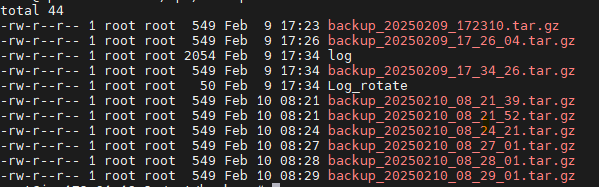

# Week 3 Challenge 2: Automated Backup & Recovery

## Objective
The goal of this challenge is to create a Bash script that automates the backup process for a specified directory. The script will:
- Take a directory path as a command-line argument.
- Create a timestamped backup of the specified directory.
- Archive the backup using TAR to save space.
- Implement a rotation mechanism to retain only the last **three** backups, deleting older ones automatically.

## Features
- **Timestamped Backups**: Each backup folder is named with a timestamp to keep track of versions.
- **Compression**: The backups are compressed using `tar` to save space.
- **Rotation Mechanism**: The script ensures that only the latest three backups are kept.

## Usage
Run the script using:
```bash
./backup_dir.sh
Please enter the source & dest  path
Usage: ./backup_dir.sh <source_direcotry> <destination_directory>

```

## Bash Script
Below is the Bash script run test and outputs

### Executing the script

```bash


root@ip-#-#-#-#:/opt/Devops/90DaysOfDevOps/Week3_challenge_2# ./backup_dir.sh /opt/my_shell_scripts/ /opt/backups/
root@ip-#-#-#-#:/opt/Devops/90DaysOfDevOps/Week3_challenge_2# ls -ltr /opt/backups/
total 32
-rw-r--r-- 1 root root  549 Feb  9 17:23 backup_20250209_172310.tar.gz
-rw-r--r-- 1 root root  549 Feb  9 17:26 backup_20250209_17_26_04.tar.gz
-rw-r--r-- 1 root root 2054 Feb  9 17:34 log
-rw-r--r-- 1 root root  549 Feb  9 17:34 backup_20250209_17_34_26.tar.gz
-rw-r--r-- 1 root root   50 Feb  9 17:34 Log_rotate
-rw-r--r-- 1 root root  549 Feb 10 08:21 backup_20250210_08_21_39.tar.gz
-rw-r--r-- 1 root root  549 Feb 10 08:21 backup_20250210_08_21_52.tar.gz
-rw-r--r-- 1 root root  549 Feb 10 08:24 backup_20250210_08_24_21.tar.gz


```
### LOG ROTATE



#### after executing log rotate script
```bash
root@ip-#-#-#-#:/opt/Devops/90DaysOfDevOps/Week3_challenge_2# ./backup_dir.sh /opt/my_shell_scripts/ /opt/backups/
tar: Removing leading `/' from member names
root@ip-#-#-#-:/opt/Devops/90DaysOfDevOps/Week3_challenge_2# cd -
/opt/backups
root@ip-#-#-#-#:/opt/backups# ls -ltr
total 20
-rw-r--r-- 1 root root 2054 Feb  9 17:34 log
-rw-r--r-- 1 root root   50 Feb  9 17:34 Log_rotate
-rw-r--r-- 1 root root  549 Feb 10 08:31 backup_20250210_08_31_01.tar.gz
-rw-r--r-- 1 root root  549 Feb 10 08:32 backup_20250210_08_32_01.tar.gz
-rw-r--r-- 1 root root  549 Feb 10 08:32 backup_20250210_08_32_14.tar.gz

```
As we can see only three tar.gz files left after log rotated.

### Logging the backup jobs along with timestamp
```bash
root@ip-#-#-#-#:/opt/Devops/90DaysOfDevOps/Week3_challenge_2# tail -10 /tmp/log
user Mon Feb 10 08:21:39 UTC 2025 Backup completed successfully! Backup saved to: /opt/backups//backup_20250210_08_21_39.tar.gz
user Mon Feb 10 08:21:52 UTC 2025 Backup completed successfully! Backup saved to: /opt/backups//backup_20250210_08_21_52.tar.gz
user Mon Feb 10 08:21:52 UTC 2025 Backup completed successfully! Backup saved to: /opt/backups//backup_20250210_08_21_52.tar.gz
```

### Adding under Crontab 

```bash
crontab -l

####Cron JOb to run shell script every 1 min to take backup########

#* * * * * sh /opt/my_shell_scripts/backup_dir.sh

* * * * * sh /opt/Devops/90DaysOfDevOps/Week3_challenge_2/backup_dir.sh /opt/my_shell_scripts/ /opt/backups/
```


## Conclusion
This Bash script provides a simple and effective way to automate directory backups while ensuring efficient storage management through backup rotation. 🚀