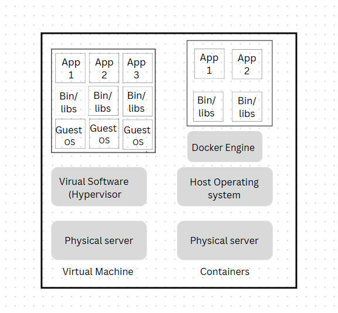

# Docker’s Purpose in Modern DevOps

In modern DevOps, Docker serves as a crucial tool to create and manage lightweight, portable application containers. It enables developers to package their applications with all necessary dependencies, ensuring consistent execution across different environments (development, testing, production).

## Key Points About Docker in DevOps

### Environment Consistency
Docker containers package an application and its dependencies into a single, portable unit. This ensures that the application runs the same way in development, testing, and production environments, reducing the "it works on my machine" problem.

### Isolation
Containers isolate applications from the underlying system and other containers. Containers run in a separate space and have their own filesystem, CPU, memory, process space, and network interfaces. This isolation allows you to run many containers on a single host.

### Scalability
Docker enables easy scaling of applications by allowing multiple containers to run simultaneously, often orchestrated by tools like Kubernetes.

## How Docker Works in DevOps

### Dockerfile
A text file defining the application's environment and dependencies, used to build a Docker image.

### Docker Image
A snapshot of the application with all required components, ready to be deployed as a container.

### Docker Container
A running instance of a Docker image, providing an isolated environment for the application.

---

# Virtualization vs. Containerization

Virtualization and containerization are both technologies used to create isolated environments for running applications, but they differ in their architecture, resource usage, and use cases.

## Virtualization

### How It Works
Virtualization relies on hypervisors (e.g., VMware, Hyper-V) to create virtual machines (VMs). Each VM includes a full copy of an operating system (OS), the application, and its dependencies.

### Isolation
VMs provide strong isolation since each VM runs its own OS.

### Resource Usage
VMs are resource-intensive because each VM requires a full OS, leading to higher overhead in terms of memory, storage, and CPU.

### Startup Time
VMs take longer to start because they need to boot an entire OS.

### Use Cases
Ideal for running multiple OSes on a single physical machine or for legacy applications that require full OS isolation.

## Containerization

### How It Works
Containerization (e.g., Docker) uses the host OS kernel to create lightweight, isolated environments called containers. Each container shares the host OS but has its own file system, libraries, and dependencies.

### Isolation
Containers provide process-level isolation, which is sufficient for most modern applications.

### Resource Usage
Containers are lightweight because they share the host OS kernel, resulting in lower overhead and better resource utilization.

### Startup Time
Containers start almost instantly since they don’t need to boot an OS.

### Use Cases
Ideal for modern, cloud-native applications, microservices, and CI/CD pipelines.

---

# Why Containerization is Preferred for Microservices and CI/CD Pipelines

### Lightweight and Efficient
Containers are smaller in size and consume fewer resources compared to VMs, making them ideal for deploying and scaling microservices, which are often numerous and need to run independently.

### Scalability
Containers can be easily scaled up or down using orchestration tools like Kubernetes, making them well-suited for dynamic microservices environments.

### DevOps Integration
Containers integrate seamlessly with CI/CD tools (e.g., Jenkins, GitLab CI) and version control systems, enabling automated builds, tests, and deployments.