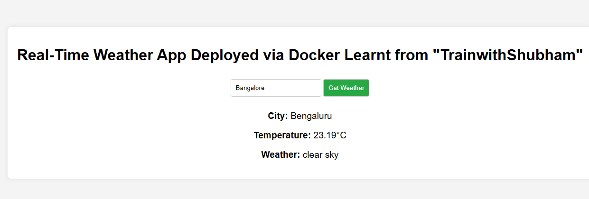

### Task Overview

In this task, I've created two projects:

1. **A simple "Hello World" Python application using the Flask framework.**
2. **A real-time weather application using JavaScript, with a base image of Node.js version 18 Alpine.**

---

### Building a Dockerfile to Deploy the "Hello World" Python Application Using Flask

#### Step 1: Configure a Dockerfile

**Dockerfile:**
```Dockerfile

FROM python:3.9-slim

## Wokring dir

WORKDIR /app

# Copying  files-dir from local into the Docker image

COPY . .

# Commands executed during the build process to install dependencies, configure the environment
RUN pip install -r requirement.txt

#ENV setting Environment variables to configure the behavior of the application or the container
ENV FLASK_APP=app.py
ENV FLASK_ENV=production


#EXPOSE PORT 5000 for flask app
EXPOSE 5000

# Run the application
CMD ["python", "app.py"]
```

Step 2: Build the docker image using docker file

```bash
docker build -t hello-world-python:latest . 
# -t means tagging image with a name and :latest is a version declaration
.
.
.

Successfully built da2a2658a658
Successfully tagged hello-world-python:latest
```


Step 3: Start the container using the built image
```bash
docker run -d -p 5000:5000 --name helloword-py_app hello-world-python

### -d detach -p port maping with container:OS --name container name


```
From below output we can see containers running status and other details like container id, image name, port number etc

```bash
docker ps

ubuntu@MYLINUXEC2:/opt/docker/python/python-mini-projects/hello_docker$ docker ps
CONTAINER ID   IMAGE                  COMMAND                  CREATED         STATUS         PORTS                                                  NAMES
aa5093f5d31d   hello-world-python     "python app.py"          5 seconds ago   Up 4 seconds   0.0.0.0:5000->5000/tcp, :::5000->5000/tcp              helloword-py_a
```

Day-to-day docker commands:
---

### Explanation of Key Options:
- **`docker ps`**: Lists running containers.
- **`docker ps -a`**: Lists all containers (running and stopped).
- **`docker stop`**: Stops a running container.
- **`docker start`**: Starts a stopped container.
- **`docker rmi`**: Removes a Docker image.
- **`docker rm`**: Removes a Docker container.
- **`docker build --platform`**: Builds an image for a specific platform (e.g., `linux/amd64`).
- **`docker system prune`**: Cleans up unused Docker objects (images, containers, volumes, and networks).
- **`docker logs`**: Displays logs of a container.
- **`docker run -it`**: Runs a container in interactive mode and attaches to its terminal.
- **`docker attach`**: Attaches to a running container's terminal.
- **`docker run -it --name container name image name /bin/bash`**
- **`docker rmi $(docker ps -aq)`**: Remove all the images,containers without using Prune


Check Container logs via command 'docker logs'

```bash
ubuntu@MYLINUXEC2:~$ docker logs aa5093f5d31d
 * Serving Flask app 'app'
 * Debug mode: off
WARNING: This is a development server. Do not use it in a production deployment. Use a production WSGI server instead.
 * Running on all addresses (0.0.0.0)
 * Running on http://127.0.0.1:5000
 * Running on http://172.17.0.3:5000
 ```


 **Project 2: A real-time weather application using JavaScript, with a base image of Node.js version 18 Alpine.**

***Folder Structure***

```bash
ubuntu@MYLINUXEC2:/opt/docker/weather-app$ ls -R
.:
Dockerfile  package.json  public  server.js

./public:
index.html  script.js  styles.css
ubuntu@MYLINUXEC2:/opt/docker/weather-app$
```

DOcker file
```bash
## Install the required NODE version 18 base image
FROM node:18-alpine


## Setting up the Working DIR
WORKDIR /sam

#Copying package and package-lock.json files
COPY  package*.json .

#COPY entire source codes to working dir inside  the container
COPY . .

# Installing dependencies from packages.json
RUN npm install

##server.js is cofigured to use port 3000, hence exposing port 3000
EXPOSE 30000

## Run the application using npm and start
CMD ["npm","start"]
```

Please note: Login to https://api.openweathermap.org and generate your API place it in server.js to get realtime weather update.

```bash
sudo apt install docker-buildx

DOCKER_BUILDKIT=1 docker build -t weather-image:latest .

docker run -d -p 3000:3000 --name weather-app weather-image:latest
```

